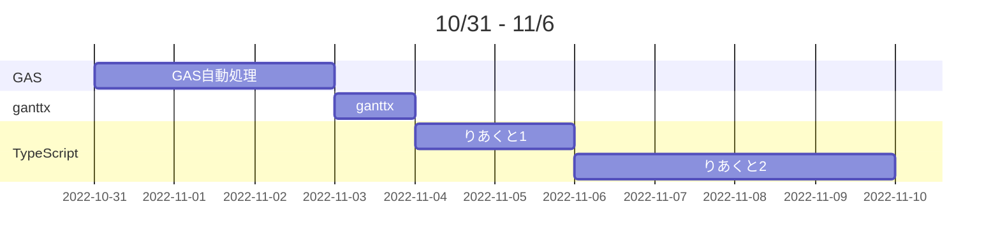
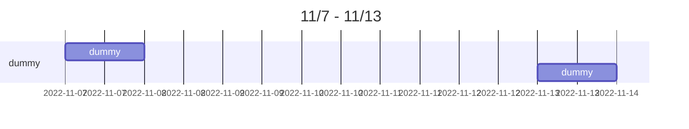
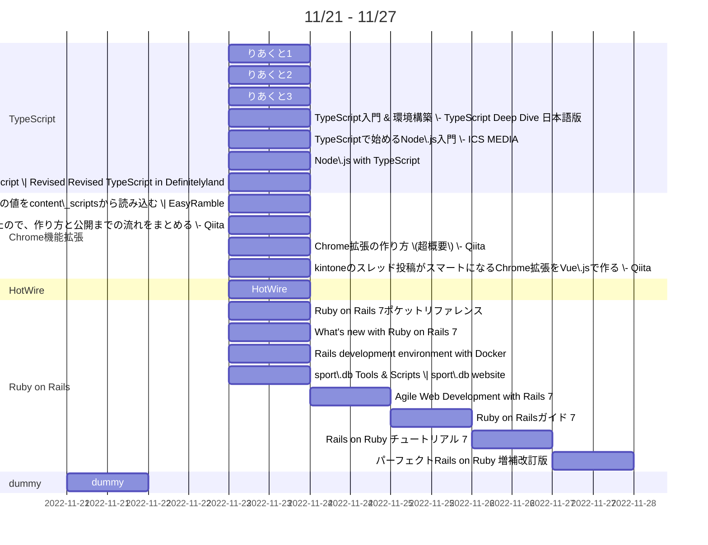
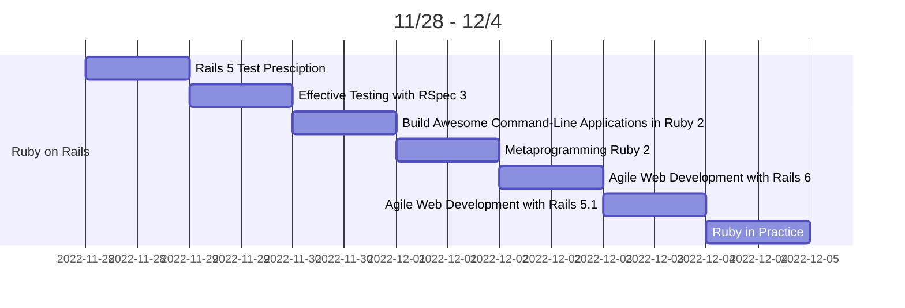
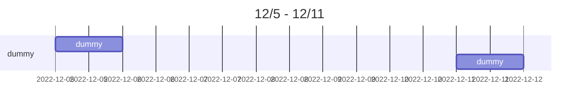

```mermaid
gantt
    title 10/31 - 11/6
    section GAS
    GAS自動処理: , 2022-10-31, 3d
    section ganttx
    ganttx: , 2022-11-03, 1d
    section TypeScript
    りあくと1: , 2022-11-04, 2d
    りあくと2: , 2022-11-06, 4d
```

```mermaid
gantt
    title 11/7 - 11/13
    section dummy
    dummy: , 2022-11-07, 1d
    dummy: , 2022-11-13, 1d
```

```mermaid
gantt
    title 11/14 - 11/20
    section dummy
    dummy: , 2022-11-14, 1d
    dummy: , 2022-11-20, 1d
```

```mermaid
gantt
    title 11/21 - 11/27
    section TypeScript
    りあくと1: , 2022-11-23, 1d
    りあくと2: , 2022-11-23, 1d
    りあくと3: , 2022-11-23, 1d
    TypeScript入門 & 環境構築 \- TypeScript Deep Dive 日本語版: , 2022-11-23, 1d
    TypeScriptで始めるNode\.js入門 \- ICS MEDIA: , 2022-11-23, 1d
    Node\.js with TypeScript: , 2022-11-23, 1d
    Revised Revised 型の国のTypeScript \| Revised Revised TypeScript in Definitelyland: , 2022-11-23, 1d
    section Chrome機能拡張
    Chrome Extensionでoptions\_pageで設定したlocalStorageの値をcontent\_scriptsから読み込む \| EasyRamble: , 2022-11-23, 1d
    はじめてChrome拡張機能を作ったので、作り方と公開までの流れをまとめる \- Qiita: , 2022-11-23, 1d
    Chrome拡張の作り方 \(超概要\) \- Qiita: , 2022-11-23, 1d
    kintoneのスレッド投稿がスマートになるChrome拡張をVue\.jsで作る \- Qiita: , 2022-11-23, 1d
    section HotWire
    HotWire: , 2022-11-23, 1d
    section Ruby on Rails
    Ruby on Rails 7ポケットリファレンス: , 2022-11-23, 1d
    What's new with Ruby on Rails 7: , 2022-11-23, 1d
    Rails development environment with Docker: , 2022-11-23, 1d
    sport\.db Tools & Scripts \| sport\.db website: , 2022-11-23, 1d
    Agile Web Development with Rails 7: , 2022-11-24, 1d
    Ruby on Railsガイド 7: , 2022-11-25, 1d
    Rails on Ruby チュートリアル 7: , 2022-11-26, 1d
    パーフェクトRails on Ruby 増補改訂版: , 2022-11-27, 1d
    section dummy
    dummy: , 2022-11-21, 1d
```

```mermaid
gantt
    title 11/28 - 12/4
    section Ruby on Rails
    Rails 5 Test Presciption: , 2022-11-28, 1d
    Effective Testing with RSpec 3: , 2022-11-29, 1d
    Build Awesome Command-Line Applications in Ruby 2: , 2022-11-30, 1d
    Metaprogramming Ruby 2: , 2022-12-01, 1d
    Agile Web Development with Rails 6: , 2022-12-02, 1d
    Agile Web Development with Rails 5.1: , 2022-12-03, 1d
    Ruby in Practice: , 2022-12-04, 1d
```

```mermaid
gantt
    title 12/5 - 12/11
    section dummy
    dummy: , 2022-12-05, 1d
    dummy: , 2022-12-11, 1d
```
